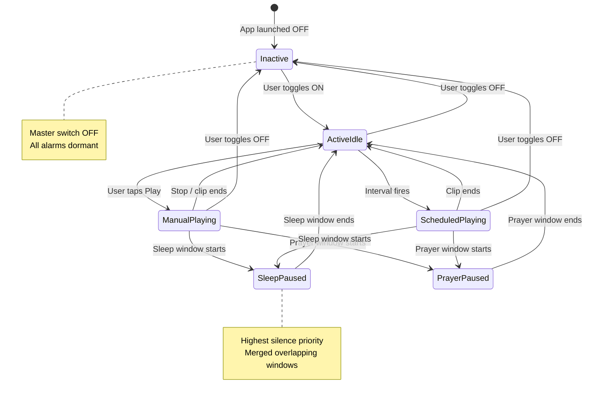

# Playback State Diagram

WhisperBack enforces a strict playback priority hierarchy. This document defines all states, transitions, and guards.

## Priority order (highest wins)

1. **App Inactive** — nothing plays, ever
2. **Sleep / Prayer Mode** — all playback paused
3. **Scheduled playback** — interval-triggered clips
4. **Manual playback** — user-initiated from playlist modal

## State machine

## State definitions

| State | Description | Audio | UI indicator |
|-------|-------------|-------|--------------|
| `Inactive` | App master switch OFF | None | Grey home toggle |
| `ActiveIdle` | ON, waiting for trigger | None | Glowing purple toggle |
| `ManualPlaying` | User playing a playlist | Clip stream | Playback modal visible |
| `ScheduledPlaying` | Interval fired | One clip per trigger | Schedule badge active |
| `SleepPaused` | Sleep window active | Paused | Zzz icon highlighted |
| `PrayerPaused` | Prayer time window | Paused | Prayer icon highlighted |

## Transition guards

### Inactive → anything playing
**Blocked.** Scheduler and manual play requests are rejected until Active.

### Sleep / Prayer → Manual play request
**Blocked** while silence window is active. Show snackbar: "Playback paused during sleep/prayer mode."

### Schedule fires during Manual play
Default: **schedule waits** until manual playback stops. (Configurable in future.)

### Schedule fires during phone call / other audio
Default: **queue** — play when audio focus returns.

### App killed and restarted
- Re-read `app_state.isActive` from SQLite
- Re-register all enabled schedule alarms
- Restore active sleep window if still in range
- Restore shuffle cycle position from persisted order

## Conflict detection (schedules)

Two schedules **overlap** if their interval windows would cause simultaneous clip playback.

On save attempt:
1. Compute next-fire times for both schedules within 24h window
2. If any pair falls within same 30-second window → **block save**
3. Show conflict dialog with both playlist names and suggested adjustment

## Platform notes

| Platform | Scheduler mechanism | Tolerance |
|----------|---------------------|-----------|
| Android | Foreground service + exact alarm | ≤30 seconds |
| iOS | Local notifications + background audio | ±1–2 minutes (disclosed in UI) |

## Implementation reference

- Coordinator: `mobile/lib/services/playback/playback_coordinator.dart`
- State enum: `mobile/lib/domain/playback/playback_state.dart`
- Priority checks run before every `play()` call
